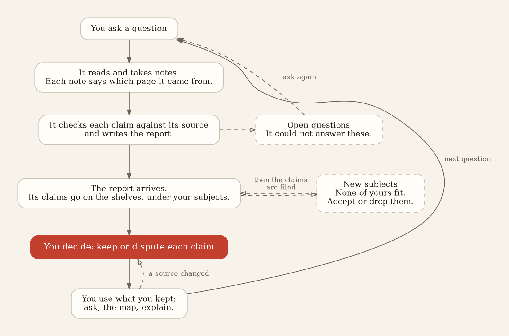

> **The command is `researchzosho`, or `zosho` for short.** Inside a CodeZaiku install, `codezaiku librarian`
> is the same command. In this source tree it is `bin/researchzosho`.

# Using ResearchZosho

This document explains how to use ResearchZosho: how to set it up, how to send a question, how to
read and review what comes back, and how to run it as a service. It is written for people who are
not programmers. The protocol for programs is in [LIBRARY_PROTOCOL.md](LIBRARY_PROTOCOL.md).

## Contents

1. What you need
2. Setup
3. The basic loop
4. Sending a question
5. Reading the write-up
6. Reviewing the claims
7. Asking what the library already has
8. Adding your own documents
9. Languages
10. Checks against bad sources
11. The housekeeping
12. Sharing the model
13. The map
14. Fields
15. Running it as a service
16. The web pages
17. Obsidian and SoloMD
18. Other programs
19. Change notifications
20. Other libraries
21. Access requests
22. Directories
23. Not yet available

## 1. What you need

- Java 21 or newer.
- A model server that speaks the OpenAI chat API. This can be a local server (llama.cpp, Ollama, LM
  Studio) or a hosted API with a key (OpenAI, DeepSeek, Gemini, OpenRouter and others; any that
  speaks the OpenAI chat API). Setup asks for the address and, for a hosted API, the key. Without a
  model you can still ask what the library has and read it; research runs need the model.
- A web search backend, for research runs that go to the web. This matters as much as the model: a
  run can only read what a search finds. The choices, best first: a Brave Search API key
  (https://brave.com/search/api/ has a free plan), a SearXNG instance (free, private; setup can start
  one with Docker), or the built-in fallback, which searches Wikipedia and the scholarly literature
  only. Section 2 explains.
- Optional: an embeddings server, if you want search by meaning as well as by keywords. With Docker
  and an NVIDIA card, setup starts one for you (Text Embeddings Inference serving Qwen3-Embedding-0.6B;
  the model downloads once, about 1.2 GB). Without a GPU, `researchzosho embed start --cpu` runs the
  CPU image, measured at a tenth of a chunk a second (a thousand documents: more than a day); an
  embeddings server on another machine is the better answer. Any server that answers the OpenAI embeddings call works. The server matters more than the
  model: the same 0.6B model measured 13 chunks a second under llama.cpp and 115 under Text Embeddings
  Inference on the same card, so a library of a thousand documents re-indexes in two minutes instead of
  twenty.

## 2. Setup

Run:

```
researchzosho setup
```

Setup asks a few questions. Each has a default answer; press Enter to accept it.

1. Where the library folder goes.
2. Which model server to use. Setup looks on the usual local ports and tests the server with one
   call before saving the address.
3. Which web search backend to use. Setup asks for a Brave Search API key first. Then it looks for
   SearXNG on its usual local port, and if Docker is installed offers to start one. With neither, it
   says that the built-in fallback will be used.
4. Whether search works by meaning or by words only. If your model server also embeds, that is used.
   Otherwise, with Docker and an NVIDIA card, setup offers to start an embeddings server
   (`researchzosho embed start` does the same later); without those it asks for an address, and with
   none search is by words.
5. Whether to run ResearchZosho as a service that starts when you log in.
6. Which programs to connect. If Claude Code, Codex or Gemini CLI is installed, setup can register
   the library with it. For any other program that speaks MCP, setup prints the command line and the
   JSON to enter.

Then setup adds one document you name and answers a question about it. Run setup again at any time
to change one of these answers.

### Web search

Research runs find their sources through a search backend. A run can only read what a search
finds, so this choice matters as much as the model. ResearchZosho tries them in this order:

1. **The Brave Search API.** The best results. A key from https://brave.com/search/api/ (there is a
   free plan) goes in `RESEARCHZOSHO_BRAVE_KEY`, or into setup. The key is sent only to Brave.
2. **SearXNG**, a search engine you run yourself. Free, and your queries stay on your machine.
   Setup starts it with Docker when Docker is installed, and so does:

   ```
   researchzosho search start
   ```

   This starts the official container on port 8888 with a settings file ResearchZosho writes. That
   file turns on the JSON format the search tool needs, and picks the engines that answered from a
   home machine when we measured them: Seznam, Naver, Yandex, Yahoo and Wikipedia. SearXNG's own
   default engines (DuckDuckGo, Google, Qwant, Startpage, Brave) answered the first query with a
   CAPTCHA and stayed suspended, so they are off. The file is `~/.researchzosho/searxng/settings.yml`;
   edit it if you like. A SearXNG elsewhere goes in `RESEARCHZOSHO_SEARXNG`.
3. **The built-in fallback**, when neither is set: Wikipedia's own search, in the language of the
   query, followed by papers from Crossref and OpenAlex. No key and no install, and all three answer
   reliably, but it finds encyclopedia pages and the literature, not the whole web. A run follows
   the pages' references for primary sources. `RESEARCHZOSHO_FALLBACK_SEARCH=off` turns it off.

With a key and a SearXNG both set, Brave is used and SearXNG is the fallback. The report's "Web
search" section says when a run went through the fallback, or when no backend answered.

Separately from all three, every research run also has `scholar_search`: Crossref and OpenAlex,
papers and books by DOI. It is there in every configuration, because a web engine ranks the primary
literature low or not at all, and a DOI is a source the library can resolve and check.

```
researchzosho search                 # which backend answers, and the container's state
researchzosho search test <query>    # one search, and which backend answered it
researchzosho search papers <query>  # the literature by DOI
researchzosho search stop            # stop the container
```

### Search by meaning

Search by words finds a claim by the words in it. Search by meaning also finds it when the question uses
other words, or another language. It needs an embeddings server: the setting is `RESEARCHZOSHO_EMBED`,
the address of any server that answers the OpenAI embeddings call, or `off`. `researchzosho embed status`
says what is configured; `embed start` runs one with Docker; `embed test` measures it; `embed stop` stops it.
After starting one, `researchzosho rebuild` indexes the library with it (the nightly housekeeping
would do that on its own the next night).

### Updating

`researchzosho status` and the page footer say when a newer release exists. To install it:

```
researchzosho update            # the installed release, the latest, and the mode
researchzosho update now        # download, verify against the release's checksums, swap in, restart the service
researchzosho update auto on    # the service updates itself after each housekeeping, when no run is active
```

The setting is `RESEARCHZOSHO_UPDATE`: `check` (default), `auto`, or `off`. The library and the settings are
never touched by an update. On Windows, stop the service first (`researchzosho service uninstall`), run
`researchzosho update now`, then `researchzosho service install`.

## 3. The basic loop

1. Send a question. Use the web pages or `researchzosho research ask "…"`. If the question is
   rough, run `researchzosho sharpen` first (section 4).
2. Read the write-up when the run is done. The pages show it with its sources. `researchzosho
   explain` gives a simpler version (section 5).
3. Review the claims. They arrive in your inbox. Accept or dispute each one (section 6).
4. Use what you kept. `researchzosho ask` answers from it. The map shows how it connects. The vault
   has it in your notes.
5. Check in now and then: open questions, proposed subjects, and claims whose source changed.

Steps 2 to 4 happen as soon as a run is done. The housekeeping (section 11) runs every night and does
the checks and cleanup.

<picture>
  <source media="(prefers-color-scheme: dark)" srcset="brand/loop-dark.png">
  
</picture>

The drawing's source is `brand/loop.dot`. `dot -Tpng` redraws it.

## 4. Sending a question

### The commands

```
researchzosho research ask "what do the trials since 2020 say about statins for someone my age"
researchzosho research ask "…" --depth          # go deep on the best sources instead of surveying
researchzosho research ask "…" --quick          # a short run: front of the line, 12 model steps, 6 minutes
researchzosho research ask "…" --shelves        # read only your own documents
researchzosho research ask "…" --max-turns 200  # limit the run to 200 model steps
researchzosho research ask "…" --max-minutes 120
```

From Claude Code or a program, the same thing is `library_research`. From the web pages, use the
Research page.

The run starts as soon as a worker is free. `researchzosho jobs <J-id>` shows its progress.

### Sharpening a question first

```
researchzosho sharpen "how were the gears cut"
```

Sharpen does not run any research. It returns:

- the question rewritten to be more specific;
- a list of what it assumed to get there, so you can see where it narrowed the question;
- a plan: what is in scope, what is out, sub-questions, the kinds of sources to look for, what a
  good answer must contain, and which languages to read in;
- what the library already has on the subject;
- up to three questions back to you, when an answer would change the plan;
- a suggested mode (broad or depth) and size (quick or full).

It writes the sharpened question to `sharpened-question.txt`. Edit it if you want, then send it with
`researchzosho research ask`. On the web pages, the "Sharpen it first" button does the same and
fills the form in with the result.

### What happens during a run

1. Planning. If you gave sub-questions, they are the plan. If not, the library works out who studies
   this kind of question and what each would ask, and makes sub-questions from that.
2. Reading. Each sub-question gets its own reader. The readers work at the same time. A reader
   searches, opens the best sources, reads them, and writes down each fact with its source and a
   quote. Search results are marked by kind (journal, primary record, reference work, blog, forum),
   and readers prefer the first three.
3. A critic checks for gaps and can send readers back for a second round.
4. The write-up is written: the answer, then where the sources disagree, then what could not be
   settled.
5. Checks. The library adds a table of every fact with its source and quote, and a numbered list of
   sources in which copies of one text count as one. Each sentence that cites a source is then
   compared with that source. Sentences the source does not support are marked.

The write-up is saved as a draft, with the readers' notes attached.

### Limits

With no limit, a run continues until the work is done. You can limit it:

- `--max-turns N`: at most N model steps for the whole run.
- `--max-minutes N`: at most N minutes. The readers stop early enough for the write-up to be
  finished; the write-up itself is never cut short, so the run may go a few minutes over.

With a limit in steps, the library plans only what fits and puts the rest on the open-questions list.

### Pages it could not read

A page behind a paywall or a login, or a site that blocks readers, is recorded as a request to you.

```
researchzosho requests                              # what it could not read, and for which question
researchzosho add paper.pdf --for <address>         # supply the document yourself
```

After you supply a document, the library uses your copy for that address.

## 5. Reading the write-up

The write-up appears on the web pages when the run is done, and in the vault if you use one. It
contains:

- the answer, in sections;
- a table of every fact with its source and a quote;
- a numbered list of sources, with the date each page says it was published;
- the citation check: which cited sentences the sources support, and which they do not;
- the languages the sources were in;
- the pages it could not read, if any.

### Simpler versions

```
researchzosho explain I-0009 --beginner          # for someone new to the field
researchzosho explain I-0009 --familiar          # for someone who knows the field but not this work
researchzosho explain "free energy principle" --in I-0009        # one term, as used in that write-up
researchzosho explain "free energy principle" --in I-0009 --now  # if the library cannot explain it: a quick look
```

On the web pages, every entry has the choices "beginner", "familiar" and "as written" at the top.

The simpler version is written only from the entry, the claims behind it, and their sources. Each
paragraph names what it comes from and is checked against it. A paragraph the sources do not support
is marked. Words you may not know are listed at the end; each one links to its own explanation.

If the library cannot explain a term from what it has, it says so and offers two choices: a quick
look (a short run, a few minutes) or full research. Either one runs as soon as a worker is free.

These explanations are kept under `readings/` in the library folder. They are not searched and never
become claims. When the entry changes, the explanation is written again.

### Downloading

On the web pages, every entry has a Download line: Markdown, or a PDF with page numbers and the
sources at the end. From the command line:

```
researchzosho export I-0009 --pdf
researchzosho export I-0009 --md --beginner
```

## 6. Reviewing the claims

```
researchzosho inbox                     # claims and write-ups waiting for your decision
researchzosho accept <id>
researchzosho dispute <id> "<reason>"
researchzosho retire <id>
```

- Accept: the claim is now part of what the library knows.
- Dispute: the claim stays, marked as disputed, and the library says so whenever it comes up.
- Retire: the claim is removed from answers. The record of it is kept.

A claim is not counted as known until you accept it. What you have accepted is what the library
answers from. A draft is also accepted on its own when a later run finds the same claim from an
independent source.

The same decisions, on every surface:

| | see what is waiting | decide |
|---|---|---|
| command line | `researchzosho inbox` | `accept <id…>`, `accept --all`, `accept --report I-…` (every waiting claim of one report) · `dispute <id> "<why>"` · `retire <id…>`, `retire --report I-…` |
| web pages | the Inbox page | tick any number, then "Accept the ticked ones", "Retire the ticked ones", or "Dispute" with a reason; a report's heading ticks all of its claims |
| a program (MCP or HTTP) | `library_inbox` with `op` list | `library_inbox` with `op` accept, dispute (`why`), or retire, and `ids`, one `id`, or `report` |
| the files | the claim's file under `findings/` in the library folder | change its `state:` line: `draft` to `accepted`, `disputed`, or `retired`; the nightly housekeeping re-reads the files, `researchzosho refresh` does it now (a removed file leaves the search too) |

Sorting a full inbox: the Inbox page, `researchzosho inbox`, and `library_inbox` filter the same way
as the open questions (section 11): by the report the claim came from (grouped, one box per report),
why it waits (a new claim, or a review that went stale), the kind of claim, the strongest source's
tier, confidence, who wrote it, subject, language, and words in the title. On the command line:
`inbox --report I-0025 --kind extraction --tier reference --confidence high --writer explorer
--state draft --subject lead-paint --language english --grep "lead paint" --by-report`.

The two pages point at each other: a report's group on the Open questions page links to its claims
in the Inbox, and a report's group in the Inbox links to its open questions. Accepting a report's
claims is what turns its questions' "what became of it" from "still in the inbox" to "kept".

## 7. Asking what the library already has

```
researchzosho ask "what do I have on keigo in subtitles?"
```

The answer lists each matching claim with its source, its state (accepted, disputed or draft), its
subjects, and nearby open questions. This answer is made from the entries themselves, not written by a
model. If there is nothing, the library says so and records the question on the open list.

Some questions are looked up directly:

- an entry id, such as `F-0004` or `I-0009`, returns that entry;
- a web address returns the saved copy of that page, if the library has one;
- "what changed since last Monday" returns the changes list;
- a subject's name returns that subject.

## 8. Adding your own documents

```
researchzosho add thesis.pdf
researchzosho add https://example.org/paper
researchzosho add ~/papers --collection thesis --register
```

Supported formats: PDF, Word, PowerPoint, OpenDocument, EPUB, HTML and plain text. The library keeps
the text, where it came from, when it was added, and the captions of figures and tables. A paper that
prints its DOI has its citation looked up.

Adding a folder makes a collection. With `--register`, the housekeeping checks the folder for new or
changed files.

To ask a question that uses only your documents:

```
researchzosho research ask "…" --shelves
```

With the default setting (`both`), readers use your documents first and the web second. A program can
also name a collection with the `collections` field of `library_research`.

## 9. Languages

A model left to itself searches in English. When a question names a place or a culture whose language
is not the language of the question, the plan gets one extra sub-question: what sources written in
that language say. The reader on it:

- starts from search queries written in that language;
- is told when a search it wrote is in the wrong language;
- goes round again if the first round found nothing in that language.

The write-up ends with a line listing the languages of its sources. At most two extra languages per
question. The language of the question itself is never added.

## 10. Checks against bad sources

The citation check confirms that a source says what a claim says. These checks address whether the
source itself is reliable. None of them uses a model's opinion.

- **One source is not enough.** Copies of one text count as one source. A source that cites another
  is not independent of it. A claim with a single independent source stays a draft until a second
  independent source confirms it, or until you accept it. When a later run finds the same claim from
  an independent source, the existing claim gains that source and is accepted. Every claim shows how
  many sources it has and how many are independent.
- **Retractions.** Every claim that cites a paper by DOI is checked against Retraction Watch,
  through Crossref, when it arrives and every thirty days. A retracted paper disputes the claim, with
  the notice as the reason. An expression of concern is noted on the claim.
- **Your own list of sites.**

  ```
  researchzosho sources trust <host> [why]    # counts as a primary source
  researchzosho sources ban <host> [why]      # never shown in searches; claims resting only on it are dropped
  researchzosho sources forget <host>
  researchzosho sources list
  ```

  A rule for a host covers its subdomains. No third-party ratings are used.
- **Dates.** Each source shows the date its page says it was published. A write-up's reference list
  shows the range of dates.
- **Unknown sites.** When a claim cites a site the library has not cited before, and the site is not
  a journal, an archive, or one you trust, the library runs one search about the site and adds a note
  to the claim with what it found.

The library does not decide whether a claim is true. It shows what supports the claim; you decide.

## 11. The housekeeping

The housekeeping runs at three each morning, or when you run `researchzosho crews`. Its steps:

| Step | What it does |
|---|---|
| serials | Runs the searches you keep (`researchzosho shelf add <name> <query>`) and lists anything new. Lists reviews that are overdue. |
| explorer | Researches a few of the open questions. |
| review | Reads new write-ups and extracts the claims, each with its source, as drafts for your inbox. |
| catalog | Files each new claim under subjects from your list. When none fits, it proposes a new subject. |
| triples | Records the connections between people, places and things that claims describe, for the map. |
| inventory | Re-reads a few accepted claims against their sources and disputes any the source does not support. |
| preprints | Checks for newer versions of preprints you cite and notes them on the claims. |
| retractions | Checks every cited DOI against Retraction Watch. |
| abstracts | Rewrites the summary of any subject whose claims changed. |
| graph | Notices when two entries look like the same person or place and writes a proposal. |
| refresh | Updates the search index. On the first of the month it rebuilds the index. |
| backup | Keeps a dated copy of the library. One week of copies is kept. |

On Sundays there are two more: a list of accepted claims that look like duplicates, and a list of
documents older than a month that nothing refers to. The housekeeping never merges, deletes or
decides. `researchzosho raw prune` deletes the documents on the second list, when you run it.

### What will run tonight

Two of the steps do research on their own. The serials step re-runs the searches you keep, on the
cadence you gave each one. The explorer step takes open questions from a queue. Nothing else searches
the web at night.

The queue: every open question has a type, a place in the order, and a state. The types are `report`
(a run left it open), `asked` (the library could not answer it at the desk; counts how often),
`person` (you added it), `dispute` (what would settle a disputed claim), and `check` (a re-read found
the source does not support a claim; a chore for the Inbox, never researched). The explorer takes
`report`, `asked` (once asked twice, `RESEARCHZOSHO_EXPLORER_MIN_ASKS`) and `person`; the set is
`RESEARCHZOSHO_EXPLORER_TYPES`. A parked question stays on the list but is never taken until you
unpark it. The questions a report leaves open are filed parked: a report leaves five to ten of them,
one per perspective, and nothing runs on them until you look. `RESEARCHZOSHO_REPORT_QUESTIONS=queued`
files them straight into the queue instead. The explorer takes the queue in order, `RESEARCHZOSHO_EXPLORER_PER_NIGHT` runs a night
(default 2; 0 turns it off); `researchzosho questions budget <n>` changes that, and `questions
tonight <n>` for one night only. Related questions share a run: the questions one report left open, or
questions whose words overlap, ride together as one run's sub-questions, up to eight, so one run
answers several. `RESEARCHZOSHO_EXPLORER_MINUTES` caps each run's minutes (default none).

To see the plan before it runs:

```
researchzosho tonight
```

It lists the searches due tonight and the ones not yet due, the open questions the explorer will
take and how many wait, how many accepted claims will be re-read, and the weekly or monthly extras.
The Runs page shows the same. `researchzosho crews` runs the housekeeping now.

### Sorting a long list of open questions

A few reports leave dozens of questions. The Open questions page, `researchzosho questions list`,
and `library_frontier` sort them the same eight ways:

| filter | what it does |
|---|---|
| left by | the report that left the question; the page groups by report, and one box ticks the whole group |
| what became of it | whether that report was kept (a claim of it accepted), is still in the inbox, was disputed, or was retired |
| asked from | the perspective the planner asked it from, the `[Historian of Science]` tag |
| subject | the subjects of the report's claims, and any subject named in the question |
| reads alike | questions whose words overlap fold under the first of them; open the fold to see them |
| maybe answered already | a claim on the shelves that already answers the question, found by search |
| language | the language the question is in, or asks for ("in Japanese-language sources") |
| words | words that must all appear in the question |

On the page each filter is a row of links with counts; the counts say what a click would show. On the
command line: `questions list --report I-0016 --fate kept --who historian --subject vae --language
japanese --grep "lead paint" --by-report --hints` (`--hints` runs the search; `--parked` shows parked
questions, `--all` everything). Over MCP or HTTP, `library_frontier` takes the same names
(`report`, `fate`, `who`, `subject`, `language`, `q`, `show`, `hints`).

Before 0.1.2, a report's questions were filed twice (once by the run, once by the review). The page
says when it finds second copies; `researchzosho questions tidy` removes them.

### Setting and unsetting what runs on its own

There are two kinds: a kept search, and an open question. Each can be set or unset four ways.

| | a kept search | an open question |
|---|---|---|
| command line | `researchzosho shelf add <name> <query> [days]` · `shelf list` · `shelf every <name> <days>` · `shelf park <name>` · `shelf unpark <name>` · `shelf remove <name>` | `researchzosho questions list [filters]` (numbered, tonight's marked) · `questions add <question>` · `questions next|later|park|unpark|drop <number>` · `questions tidy` · `questions budget <n>` · `questions tonight <n>` |
| web pages | the Open questions page: "Keep a search"; beside each one, its every-N-days field with "Change", "Park" or "Back in the rotation", and "Stop keeping it" | the same page: the eight filters above, grouped by report; tick any number, then "Send as runs now", "Run next", "Later", "Park" or "Back in the queue", "Drop"; the nightly budget and tonight's override; "Add an open question" |
| a program (MCP or HTTP) | `library_serials` with `op` list, add `{name, query, every_days}`, every `{name, every_days}`, park or unpark `{name}`, or remove `{name}` | `library_frontier` with `op` list (with the filters; each question carries type, parked, position, tonight, report, report_fate, perspective, subjects, language, similar), add, next, later, park, unpark, drop `{question}`, or tidy |
| the files | `catalog/shelves.md` in the library folder, one line each: `- name \| query \| every N days \| last YYYY-MM-DD`, with `\| parked` at the end to park one | `frontier/OPEN.md`, one line each: `- YYYY-MM-DD [kind] question`; a line ending `⇒ explored …` is closed |

A parked search is kept and shown but does not run until you put it back; the questions' park works
the same way.

The files are plain markdown; edit them in any editor and the next housekeeping reads them. The vault
has a `Housekeeping` note that shows both lists and says where the files are, so an Obsidian or
SoloMD user can find them; the vault itself is a view and editing it changes nothing. A dropped
question stays in the file, marked dropped, so it is not filed again.

The review, catalog, triples and abstracts steps also run as soon as a write-up arrives, so you do not
have to wait for the night. `researchzosho settle` runs them by hand for any write-ups still waiting.

### Proposed subjects

```
researchzosho subjects proposed          # the proposals, numbered
researchzosho subjects accept 3 7        # accept by number or by slug; "all" accepts every one
researchzosho subjects drop 12           # "all" clears the list
researchzosho settle                     # then file the waiting claims under the new subjects
```

You can also edit `catalog/subjects.md` directly.

Everything the housekeeping does is logged in `catalog/crews.log`. Steps that need a model are
skipped when no model is available.

## 12. Sharing the model

Research runs use the same model, and usually the same graphics card, as everything else on your
computer. These settings can be changed while a run is in progress:

```
researchzosho research workers 2              # how many readers work at once (default 3)
researchzosho research pause                  # hold everything at the next step
researchzosho research resume
researchzosho research stop J-0031             # end one run at its next step; a queued one never starts
researchzosho research window 22:00-07:00     # only start runs in these hours
researchzosho research window off
researchzosho research                        # show the settings and what is running
```

The Runs page has the same: "Pause the runner" and "Resume", and a "Stop" beside each run that is
queued or going. A stopped run is recorded as stopped, not failed. If the stop comes after the
write-up landed, while its claims are being reviewed and catalogued, those steps end at the next one
and the nightly housekeeping finishes them. Over MCP or HTTP, `library_job`
takes `op` stop with `job_id`, pause, or resume.

The settings are stored in your config file. A running question follows a changed setting at its next
step.

Without any setting, the readers slow themselves down when the model slows to half its usual speed
because something else is using the card.

### Two models

`RESEARCHZOSHO_JUDGE_DRIVE` names a second model server for planning, the critic, the write-up and the
citation check. The readers keep using the first server. This lets a stronger rented model do the
judging while a local model does the reading.

## 13. The map

When a claim says that a person lived in a place, an author wrote a work, or a company holds a
patent, the library records that connection. The map shows these connections.

```
researchzosho map "Arthur Ellis"
researchzosho map "Arthur Ellis" --depth 2
```

On the web pages, the map is at `http://127.0.0.1:4649/map`. Programs use `library_map`.

Subjects are on the map as squares. Each name is connected to the subjects its claims are filed
under. Type a subject's name or slug to start from it. If a name finds nothing, the map lists the
names it knows, spelled as they appear in the claims.

A write-up's claims are added to the map as soon as the write-up arrives.

Commands for the map:

```
researchzosho graph merge "A. Ellis" "Arthur Ellis"   # two names are one person; the housekeeping only proposes this
researchzosho graph alias <node> <name…>              # other names for someone, in any language
researchzosho graph kind <node> person --private      # hide a person from everyone but you
researchzosho graph link <node> Q123                  # link to a Wikidata entry
researchzosho graph proposals
```

## 14. Fields

The core library has no built-in subject knowledge. A field adds some.

- `science` is on by default: citations looked up from the record, preprint versions tracked, BibTeX
  with `researchzosho bib <id>`.
- `genealogy`: `researchzosho profile enable genealogy`. Adds family relations. `genealogy import
  tree.ged` reads a family-tree file: each person becomes a node, each relation a draft claim with the
  file as its source, and living people are kept private. `genealogy export "Arthur Ellis"` writes one
  out.

## 15. Running it as a service

```
researchzosho service install            # Linux, macOS or Windows; a user service, no administrator rights
researchzosho service status
researchzosho service uninstall
```

The service listens on `127.0.0.1:4649`, runs the housekeeping at three each morning (`--crew-hour`
changes the hour), and writes its log to `~/.researchzosho/logs/librarian-serve.log`. On Linux,
`loginctl enable-linger <you>` keeps it running while you are logged out.

By default only the computer it runs on can reach it. To reach it from other machines on your network:

```
researchzosho service install --host 0.0.0.0
```

It then also answers on the computer's network address, for example `http://192.168.1.20:4649/`.
Before doing this, read section 16 on sign-in. Do not expose the service to the internet: there is no
encryption, and tokens travel in the clear.

## 16. The web pages

Open `http://127.0.0.1:4649/` in a browser. The pages are:

| Page | What it shows |
|---|---|
| Home | A question box, the library's counts, recent changes, open questions, and what is running. |
| Ask | The same answer as `researchzosho ask`. |
| Search | Search of the library. |
| Entry | A claim, write-up, summary or saved document in full, with its sources, notes, review and connections. |
| Subjects | The subject list. |
| Inbox | Claims waiting for a decision, grouped by the report they came from and filtered nine ways. Tick any number, then accept, retire, or dispute them with a reason. |
| Open | The searches kept up to date, and the open questions, grouped by the report that left them and filtered eight ways: tick any number, then send them as runs, reorder, park, or drop them. |
| Changes | What changed, newest first. |
| Runs | What the housekeeping will do tonight; research runs, running and finished. "Pause the runner" holds every run at its next turn until "Resume"; "Stop" beside a run ends that one. |
| Research | Send a question, or sharpen it first. |
| Map | The map. |

Every entry has "Read it: beginner · familiar · as written" and a Download line.

### Sign-in

Access is open as shipped, and the home page says so. To require a sign-in before a question can
be sent:

```
researchzosho web signin on
researchzosho reader token <did>         # make a token for a person; they enter it once on the sign-in page
researchzosho web signin off
```

Reading stays open as long as the library's default access level is `read`. `researchzosho reader
default deny` closes reading too.

### Waiting and double sends

When the library has to think (sharpening a question, writing a simpler version), the page returns
at once, shows what it is doing, and updates itself until the result is ready. A second click on
Send, a refresh, or the back button does not send a question twice; the page shows what was already
sent.

## 17. Obsidian and SoloMD

The library's own files are records and are not meant to be edited by hand. The library can write a
separate folder for an editor:

```
researchzosho vault                      # writes <library>-vault next to the library
```

Open that folder in Obsidian, SoloMD, SilverBullet or any editor that reads Markdown with links. Start
at the Home note. Every claim, write-up, saved document, subject, person and place is a note with
frontmatter and links. The editor's graph view shows the same connections as the map. The Inbox note
lists what is waiting for you.

Once the folder exists, the service keeps it up to date within seconds of any change to the library.
Only notes that changed are rewritten.

The vault is a one-way view. Editing a note there does not change the library. Notes you add are left
alone, and a note the library wrote is not overwritten after you edit it. To accept or dispute, use
`researchzosho inbox` or a program connected over MCP.

In Obsidian nothing needs to be installed. Two things help:

- Bases (built into Obsidian) turns the notes' frontmatter into tables, for example every claim by
  state, or everything under one subject.
- The AI Copilot community plugin can connect to `researchzosho mcp` as a local server, so you can
  ask the library from the sidebar, using your own key or a local model.

SoloMD has no plugins and needs none. Its agent panel works with the vault. To talk to the library
itself, use the web pages or `codezaiku chat`.

## 18. Other programs

Anyone or any program that uses the library is a reader. You decide who may read and who may write.

The web pages and the vault need no program. To talk to the library, `codezaiku chat` runs on a local
model, for free, and connects to the service: what the library holds is pushed into each turn,
`/librarian` asks it, and `/research` files runs with it. `codezaiku install researchzosho` sets that
up, including the write token the chat needs to file runs.

Claude Code, Codex and Gemini CLI can use the library directly, without the service running:

```
claude mcp add --scope user librarian -- researchzosho mcp
codex mcp add librarian -- researchzosho mcp
gemini mcp add -s user librarian researchzosho mcp
```

Any other program that speaks MCP takes the same server: the command `researchzosho` with the
argument `mcp`. In JSON form:

```
{"mcpServers": {"librarian": {"command": "researchzosho", "args": ["mcp"]}}}
```

Or through the service, with a token so that submissions carry a name:

```
researchzosho reader allow did:key:me write "my name"
researchzosho reader token did:key:me
claude mcp add --transport http --scope user librarian http://127.0.0.1:4649/rpc --header "Authorization: Bearer <token>"
gemini mcp add -s user -t http librarian http://127.0.0.1:4649/rpc -H "Authorization: Bearer <token>"
```

The tools available are: ask, search, get, read, established, submit, research, sharpen, explain, job,
map, perspectives, frontier, subjects, status and changes. [LIBRARY_PROTOCOL.md](LIBRARY_PROTOCOL.md)
describes each one.

## 19. Change notifications

A program that cites your claims can be told when they change, instead of checking every day.

```
researchzosho reader webhook add did:key:zW https://their.example/hook --events retired,revised
researchzosho reader webhook list
researchzosho reader webhook remove did:key:zW https://their.example/hook
```

Every change on the feed is posted to the address: a claim retired, disputed or revised, or a source
you supplied for a page that could not be read. Each post carries the change, the library it came
from, and a signature made with a secret the reader was given. If the address does not answer, the
library tries three times and then writes a line in `catalog/webhooks.log`. The changes feed remains
the record; a missed post is caught the next time the reader asks for changes.

A program can subscribe itself with `library_subscribe`.

## 20. Other libraries

If the keeper of another library has given you a reader token, your library can ask theirs.

```
researchzosho peer add ana https://ana.example <token> --group family
researchzosho peer add lab-archive https://lab.example <token> --group lab
researchzosho peer list
researchzosho peer ask family "where did Tanaka Ichiro live after 1920"
```

The answer comes back one library at a time, labelled with whose it is. Nothing is copied or merged.
To keep one of their claims, accept it; it then carries their library's name as its source.

Two rules. One hop only: your library asks its peers and never its peers' peers. And a peer sees only
what its reader level allows.

A program can name a peer, a group or `all` in the `peers` field of `library_ask`. With
`peers.default = family` in your config, an ask that finds nothing at home asks the family group.

## 21. Access requests

Someone who finds your library can ask to be let in. `library_request_access` takes a did, a name
and a note, and works even on a library whose default is deny. They receive a request id and a claim
secret, shown once. `researchzosho status` shows "access requests waiting".

```
researchzosho reader requests                          # who asked, when, and what they wrote
researchzosho reader approve R-0003 read               # or write
researchzosho reader deny R-0004 "not a member of the society"
```

Approving adds them to the reader list and makes a token. They collect it with `library_access`,
using the request id and their claim secret, and can collect it exactly once. A denial returns your
reason. One pending request per person, fifty per library. A request expires after thirty days.

## 22. Directories

A directory is a library whose claims are listings of other libraries.

```
researchzosho directory publish https://family-libraries.example --token <t> --url https://mine.example
researchzosho directory find https://family-libraries.example "who has records of Osaka families"
researchzosho directory list                        # where this library is listed
```

Publishing submits one claim to the directory: your library's name and id, its address, up to twelve of
its subjects, and where to ask for access. It says nothing about the library's contents. It is a draft
until the directory's owner accepts it. You need a writer's token on the directory to publish.

Finding is a search of the directory. The result is a name and an address; access is requested as in
section 21.

Anyone can run a directory. It is a library with its default access set to read and a few writers.
There is no central directory. Only you can list your library.

## 23. Not yet available

- Sharing one library between two households.
- Search reranking. It is built but off, because it did not improve results at this size.
